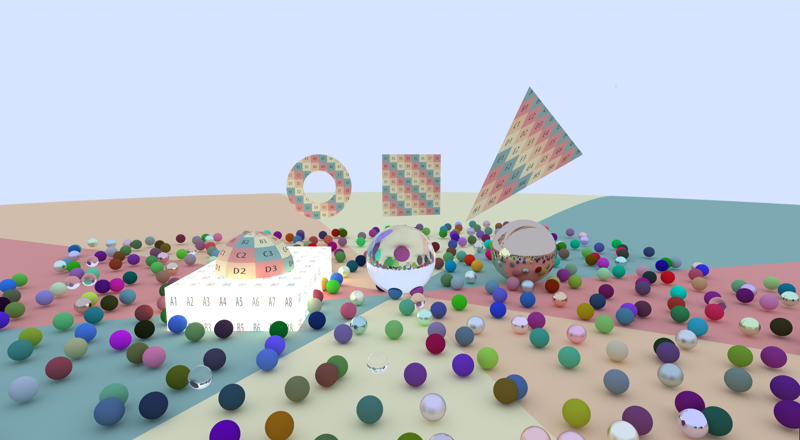
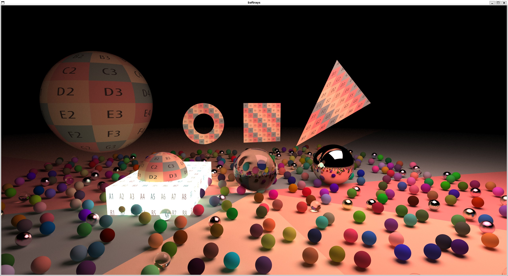
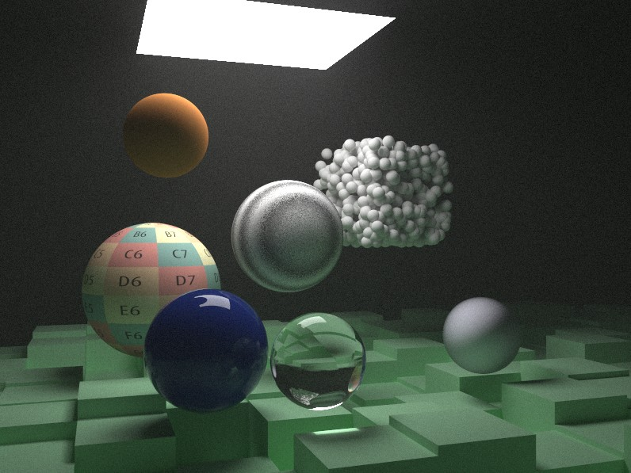

# Softrays

This project is a basic software ray-tracer,
based off of [_Ray Tracing in One Weekend_](https://raytracing.github.io/books/RayTracingInOneWeekend.html).

## Features

- Complete features from [_Ray Tracing in One Weekend_](https://raytracing.github.io/books/RayTracingInOneWeekend.html),
  but reorganized to be more C++-styled
- Features from [_Ray Tracing: The Next Week_](https://raytracing.github.io/books/RayTracingTheNextWeek.html),
  reorganized to be more C++-styled (and excluding motion blur, TBC)
- Ray-tracing of spheres
- Reflections
- Refractions
- Antialiasing (Multi-sampling)
- Diffuse (Lambertian) materials
- Metalic materials, with support for fuzziness (brushed-look)
- Dielectric materials (like glass, etc.)
- Defocus Blur
- Camera, with support for:
  - Positioning
  - Field-of-view
- Utilities:
  - Vector maths
  - Random number generation
- BVH
- Perlin Noise
- Programmatic Texturing
- Texture Sampling
- Volumetric material (with support for surface texturing)
- Quads, Triangles, Ellipses, and Doughnuts (Annuli) shapes
- Basic transformations (Translation, Y rotation)
- Emissive materials and diffuse lights

## What's next

- [x] Major refactoring
- [x] Unit Tests
- [x] Book 2 [_Ray Tracing The Next Week_](https://raytracing.github.io/books/RayTracingTheNextWeek.html)
- [ ] Book 3 [_Ray Tracing: The Rest of Your Life_](https://raytracing.github.io/books/RayTracingTheRestOfYourLife.html)
- [ ] More Unit Tests
- [ ] Naming convention refactoring
- [ ] `const` correctness validation
- [ ] Minimize copies
- [ ] Performance enhancements and deep-dives
  - [ ] Profiling
  - [ ] Data Layouts
  - [ ] Multithreading
  - [ ] SIMD
- [ ] Rework transformations
- [ ] Support real motion
  - [ ] Then add Motion Blur
