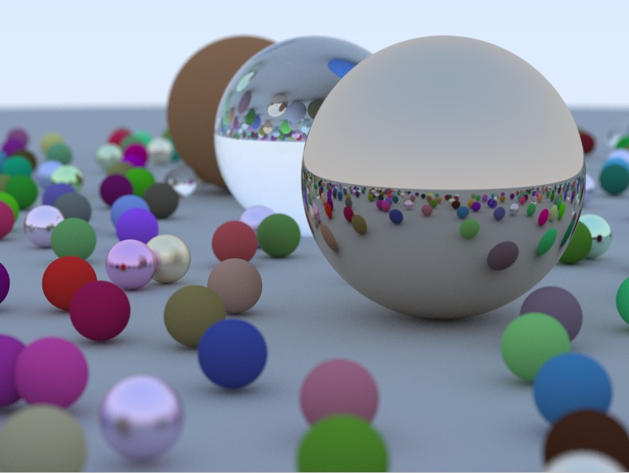

# Softrays

This project is a basic software ray-tracer,
based off of [_Ray Tracing in One Weekend_](https://raytracing.github.io/books/RayTracingInOneWeekend.html).

## Features

- Complete features from [_Ray Tracing in One Weekend_](https://raytracing.github.io/books/RayTracingInOneWeekend.html),
  but reorganized to be more C++-styled
- Ray-tracing of spheres
- Reflections
- Refractions
- Antialiasing (Multi-sampling)
- Diffuse (Lambertian) materials
- Metalic materials, with support for fuzziness (brushed-look)
- Dielectric materials (like glass, etc.)
- Defocus Blur
- Camera, with support for:
  - Positioning
  - Field-of-view
- Utilities:
  - Vector maths
  - Random number generation

## What's next

- Major refactoring
- Unit Tests
- Performance enhancements and deep-dives
  - Profiling
  - Data Layouts
  - Multithreading
  - SIMD
